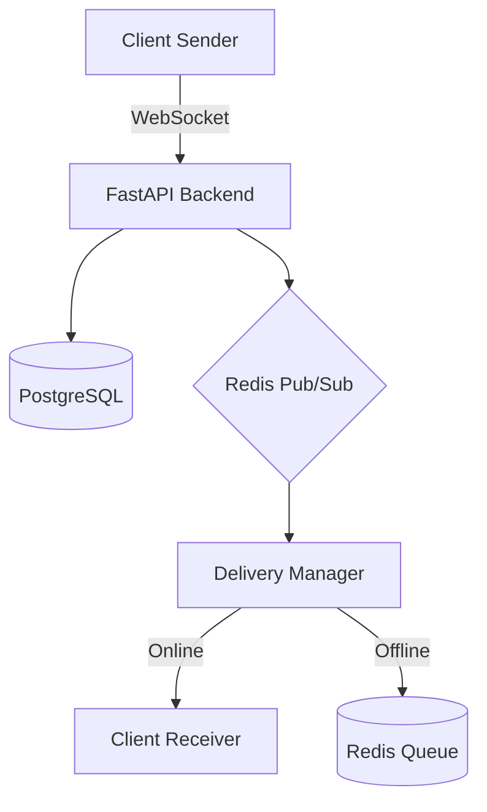

# 📨 Messenger Core - Асинхронный API-сервис для обмена сообщениями в реальном времени

###

<div align="center">
  
  
  
  
  
  
  
  
  
  
  
  
  
</div>

## 📋 Содержание

  

- [Цель проекта](#цель-проекта)

- [Стек технологий](#стек-технологий)

- [Структура проекта](#структура-проекта)

- [Быстрый старт](#быстрый-старт)

- [API документация](#api-документация)

- [Архитектура и технические решения](#архитектура-и-технические-решения)

---

## 🎯 Цель проекта

  

Проект создан для практического изучения WebSockets и Redis в рамках распределённых систем. Основное внимание уделено построению асинхронной backend-архитектуры и механизмам надёжной доставки сообщений.

  

##  🛠 Стек технологий

  

-  **Core:** Python 3.11, FastAPI (Asynchronous)

-  **Storage:** PostgreSQL + SQLAlchemy 2.0 (Async Engine), Alembic

-  **Real-time & Cache:** Redis (Pub/Sub для WebSockets, Caching)

- **QA:** Pytest (48 tests, Service & Router coverage)

- **DevOps:** Docker, Docker Compose, GitHub Actions (CI/CD)


## 📁 Структура проекта

  
```text
name-folder/
├── .github/
│   └── workflows/
│       └── test.yml                 # CI: тесты
│
├── backend/
│   ├── app/
│   │   ├── core/                    # Базовая конфигурация
│   │   │   ├── config.py            # Конфигурация приложения
│   │   │   └── security.py          # JWT, хеширование пароля
│   │   │
│   │   ├── dependencies/            # FastAPI зависимости
│   │   │   └── auth.py              # Получение текущего пользователя
│   │   │
│   │   ├── models/                  # SQLAlchemy модели БД
│   │   │   ├── base.py              # Базовая модель
│   │   │   ├── chat.py              # Модель чатов
│   │   │   ├── message.py           # Модель сообщений
│   │   │   ├── participant.py       # Модель участников
│   │   │   └── user.py              # Модель пользователей
│   │   │
│   │   ├── redis/                   # Логика работы с Redis
│   │   │   └── manager.py           # Менеджер состояния
│   │   │
│   │   ├── routes/                  # API endpoints
│   │   │   ├── auth.py              # Эндпоинты авторизации
│   │   │   ├── chat.py              # Эндпоинты чатов
│   │   │   ├── messages.py          # Эндпоинты сообщений
│   │   │   ├── users.py             # Эндпоинты пользователей
│   │   │   └── websocket.py         # WebSocket endpoint
│   │   │
│   │   ├── schemas/                 # Pydantic схемы
│   │   │   ├── chat.py              # Схемы чатов
│   │   │   ├── message.py           # Схемы сообщений
│   │   │   ├── token.py             # Схемы токенов
│   │   │   └── user.py              # Схемы пользователей
│   │   │
│   │   ├── services/                # Бизнес-логика
│   │   │   ├── auth_service.py
│   │   │   ├── chat_service.py
│   │   │   └── message_service.py
│   │   │
│   │   ├── utils/                   # Вспомогательные утилиты
│   │   │   └── json_encoder.py
│   │   │
│   │   ├── websocket/               # WebSocket-логика
│   │   │   └── manager.py           # Менеджер соединений
│   │   │
│   │   ├── database.py              # Настройка SQLAlchemy
│   │   └── main.py                  # Точка входа FastAPI
│   │
│   ├── tests/
│   │   ├── api.py                   # Тестовые схемы / хелперы
│   │   ├── integration/             # Интеграционные тесты
│   │   ├── services/                # Тесты сервисов
│   │   ├── unit/                    # Unit-тесты (в т.ч. WS)
│   │   └── conftest.py              # Фикстуры
│   │
│   ├── alembic.ini
│   ├── docker-compose.yml
│   ├── Dockerfile
│   ├── entrypoint.sh
│   ├── poetry.lock
│   ├── poetry.toml
│   ├── pytest.ini
│   └── README.md
|   └── websocket.log

```

### 🔍 Назначение компонентов


#### Backend (FastAPI)

  
| Каталог      | Назначение                    |
| ------------ | ----------------------------- |
| core         |  Конфигурация и инфраструктура |
| dependencies | FastAPI зависимости           |
| models       | ORM-модели БД                 |
| redis        | Работа с Redis                |
| routers      | HTTP API                      |
| schemas      | Pydantic-схемы                |
| services     | Бизнес-логика                 |
| utils        | Вспомогательные функции       |
| websocket    | WebSocket логика              |
| database     | Подключение к БД              |
| main         | Точка входа                   |
| tests        | Тесты                         |
  

## 🚀 Быстрый старт

  

### Локальная разработка 

#### 1️⃣ Клонирование репозитория

```bash
git  clone  https://github.com/yourusername/Real-time-messenger-backend.git

cd  backend
```


#### 2️⃣ Настройте переменные окружения:

```bash
# Отредактируйте .env
cp .env.example .env
```

#### 3️⃣ Активируйте виртуальное окружение Poetry:

```bash
poetry install        # устанавливаем зависимости
poetry shell          # активируем окружение
```

#### 4️⃣ Запустите систему через Docker Compose:

```bash
docker-compose up -d --build
```

После запуска сервис будет доступен по адресу: **http://localhost:8000**

Интерактивная документация API (Swagger): **http://localhost:8000/docs**


  

## 📚 API документация

  

### Основные endpoints

  

#### Auth (Авторизация)

  
| Метод | Endpoint | Описание |
|------|----------|----------|
| POST | `/auth/register` | Регистрация пользователя |
| POST | `/auth/login` | Авторизация пользователя |
| POST | `/auth/refresh` | Смена токена |
| POST | `/auth/logout` | Выход из аккаунта |

  

#### Chat (Чат)

  
| Метод | Endpoint | Описание |
|------|----------|----------|
| POST | `/chats` | Создание нового чата  |
| GET | `/chats` | Список чатов пользователя  |
| GET | `/chats/search` | Поиск пользователя |
| POST | `/auth/logout` | Выход из аккаунта |


#### Messages (Сообщения)

 
| Метод | Endpoint | Описание |
|------|----------|----------|
| POST | `/messages` | Отправка сообщения  |
| GET | `/messages` | Получить сообщения из чата  |
| DELETE | `/messages/{message_id}/delete` | Удалить сообщение в чате |
| PATCH | `/messages/{message_id}/edit` | Изменить сообщение в чате |

#### Users (Пользователь)

 
| Метод | Endpoint | Описание |
|------|----------|----------|
| GET | `/users/me` | Получить профиль текущего пользователя  |
  

### Примеры запросов

  

#### Получить информацию о текущем пользователе

  

```bash

curl  -X  GET  "http://localhost:8000/users/me"
Authorization: Bearer <YOUR_JWT_TOKEN>

```

  

**Ответ:**

  

```json
{

"id": 1,

"username": "user1",

"email": "u1@test.com",

"is_active": True,

"created_at": "2026-02-02T18:20:21",

}
```

  

#### Отправить сообщение user1 -> user2

  

```bash

curl  -X  POST  "http://localhost:8000/messages"  \
Authorization: Bearer <YOUR_JWT_TOKEN>

-H "Content-Type: application/json" \

-d  '{

"chat_id":  2,

"content":  "test"

}'

```

  

**Ответ:**

  

```json
{

"id":  1,

"chat_id":  2,

"sender_id":  1,

"content":  "test",

"created_at":  "2026-02-08T18:10:12",

"delivered_at":  null,

"read_at":  null,

"is_delete":  false

}
```


Полная документация API с интерактивными примерами доступна по адресу:

**http://localhost:8000/api/docs** (Swagger UI)


## 🏗 Архитектура и технические решения

### 📡 Масштабируемый WebSocket (Redis Pub/Sub)

Для работы в распределённой среде (при запуске нескольких инстансов приложения) реализована следующая схема обмена сообщениями:

-   **Client → Server A** — сообщение отправляется по WebSocket.
    
-   **Server A → Redis** — публикация сообщения в канал (Pub).
    
-   **Redis → Server B/C/D** — все инстансы получают сообщение (Sub).
    
-   **Server X → Target Client** — доставка сообщения конечному получателю.
    
    
_Данный подход исключает проблему «потерянных» сообщений, если отправитель и получатель подключены к разным серверам._


### 📩 Обработка offline-сообщений

Система учитывает текущее состояние пользователя (**online / offline**):

-   **Online** — при наличии активного WebSocket-соединения `Delivery Manager` мгновенно доставляет сообщение.
    
-   **Offline** — при отсутствии соединения сообщение помещается в очередь (Redis Queue / List).
    
-   **Синхронизация** — при следующем подключении (WebSocket Handshake) клиент получает накопленные сообщения из очереди, что гарантирует доставку даже после перезапуска приложения.

### 🛠 Паттерны и безопасность

-   **Service Layer** — бизнес-логика отделена от FastAPI-роутеров, что упрощает тестирование и обеспечивает высокое покрытие.
    
-   **Auth** — реализована надёжная схема **Access / Refresh** токенов с хешированием паролей через `bcrypt`.
    
-   **Reliability** — entrypoint-скрипты в Docker гарантируют, что приложение не стартует до готовности базы данных.

### 🔍 Общая схема доставки сообщений



### 🔌 WebSocket Protocol

**Endpoint:** `/ws`  
**Аутентификация:** `Authorization: Bearer <JWT>`

### Client → Server


| Event | Описание | 
|------|----------|
| message | Отправка нового сообщения | 
| read | Подтверждение прочтения сообщений (batch) | 
| edit_message | Редактирование ранее отправленного сообщения | 
| pong | Ответ на heartbeat от сервера | 

### Server → Client


| Event | Описание | 
|------|----------|
| connected | Успешное установление WebSocket-соединения | 
| message | Новое входящее сообщение | 
| message_edited | Уведомление об изменении сообщения | 
| error | Ошибка обработки запроса | 
| ping | Проверка активности соединения | 

### Гарантии доставки и ограничения

-   **At-least-once delivery** — сообщение будет доставлено минимум один раз
    
-   **Offline-доставка** — поддержка оффлайн-сообщений через Redis-очереди
    
-   **Persistence** — статусы доставки и прочтения сохраняются в БД
    
-   **Rate limiting** — ограничение частоты отправки сообщений
    
-   **Heartbeat** — автоматическое закрытие неактивных соединений
    
-   **Stateless backend** — состояние соединений хранится только в Redis


## 🧪 Тестирование

  

### Backend тесты (pytest)

  
```bash
cd  backend

poetry run pytest
```
<div  align="center">

[](https://github.com/warmzera1)

</div>
